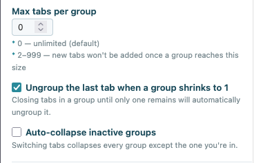
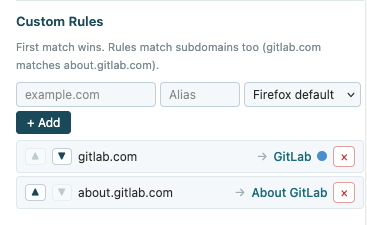
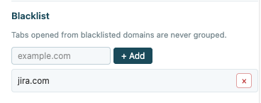
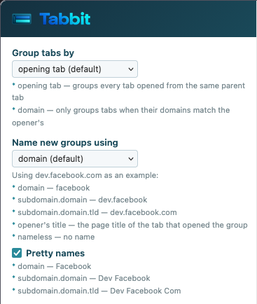

# Tabbit - Automatic Tab Grouping

Automatic tab grouping for Firefox. When you open a link in a new tab, Tabbit groups it with the tab
that opened it.

Requires **Firefox 139** or newer.

## Features

- **Group by opening tab or domain** — group every tab from the same opener, or only when domains
  match
- **Configurable group naming** — name groups by domain, subdomain, full hostname, page title, or
  leave nameless
- **Pretty names** — capitalize and clean up group names automatically
- **Max tabs per group** — cap how many tabs a group can hold
- **Auto-ungroup lonely tabs** — dissolve a group when it shrinks to one tab
- **Auto-collapse inactive groups** — keep only the active group expanded
- **Custom rules** — override group name and color for specific domains, with ordered
  first-match-wins evaluation
- **Blacklist** — prevent specific domains from being grouped

All settings are accessible from the toolbar popup — click the Tabbit icon in your toolbar.

## Screenshots

| Settings                                                        | Custom Rules                                                  | Blacklist                                               |
| --------------------------------------------------------------- | ------------------------------------------------------------- | ------------------------------------------------------- |
|  |  |  |

| Group Naming                                             | Custom Rules in Action                                     |
| -------------------------------------------------------- | ---------------------------------------------------------- |
|  |  |

## Install

Coming soon to [addons.mozilla.org](https://addons.mozilla.org).

## License

[GPL-3.0](LICENSE.md)
